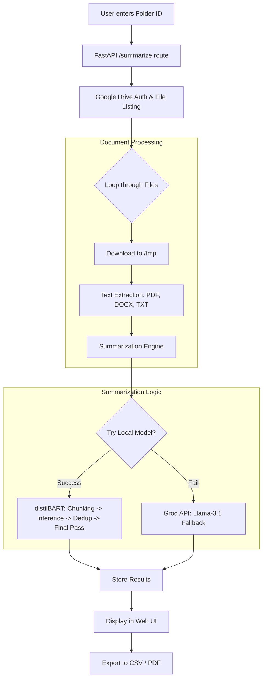

# 📄 Document Summarizer via Google Drive

A FastAPI-powered application that connects to your Google Drive, downloads documents (PDF, DOCX, TXT), summarizes them with AI, and displays results in a styled web interface — with CSV and PDF export.

## 🤖 AI Models (Auto-Fallback)

| Priority | Model | Type |
|---|---|---|
| **Primary** | `sshleifer/distilbart-cnn-12-6` | Local (HuggingFace, CPU Based) |
| **Fallback** | `llama-3.1-8b-instant` | Groq Cloud API (free) |

If the local model fails (e.g. OOM), the app automatically falls back to Groq transparently.

---

## ⚙️ System Workflow



### Pipeline:
1.  **Ingestion - The Trigger**: You enter a Google Drive Folder ID, and the application authenticates via OAuth2. It scans for supported files (PDF, DOCX, TXT) and automatically handles **Google Docs** by converting them to `.docx` during the download process.
2.  **Extraction**: Dispatches to the correct parser (`PyMuPDF` for PDF, `python-docx` for Word).
3.  **Local Summarization**:
    - **Chunking**: Splits long documents into ~3000-character segments to fit BART's context window (reflecting its strict **1024-token limit**).
    - **Deduplication**: Removes redundant phrases/sentences generated across blocks.
    - **Coherence Pass**: If a document is long (multi-chunk), the engine takes all individual chunk summaries and runs them through BART one final time to create a single, unified narrative instead of disjointed pieces.
4.  **Resilience**: If local hardware resources are insufficient (e.g., OOM), the system auto-switches to the **Groq API** for cloud inference using the high-quality **`llama-3.1-8b-instant`** model.

---

## 🚀 Setup

### 1. Clone and Install Dependencies

```bash
cd doc-summarizer
pip install -r requirements.txt
```

> ⚠️ The `torch` line in `requirements.txt` installs the CPU-only version. This is intentional for systems without a dedicated GPU.

---

### 2. Google Drive Credentials

1. Go to [Google Cloud Console](https://console.cloud.google.com)
2. **Create a project** (or select existing)
3. Enable **Google Drive API** (APIs & Services → Enable APIs → search "Drive")
4. **Create OAuth 2.0 credentials**:
   - APIs & Services → Credentials → Create Credentials → OAuth Client ID
   - Application type: **Desktop App**
   - Download the JSON → rename to **`credentials.json`**
5. Place `credentials.json` in the project root (`doc-summarizer/`)

> On first run, a browser window will open for you to authorize. After that, `token.json` is saved and reused.

---

### 3. Environment Variables

Copy the example file and fill in your values:

```bash
copy .env.example .env
```

Edit `.env`:
```env
GOOGLE_DRIVE_FOLDER_ID=your_folder_id_here
GROQ_API_KEY=your_groq_api_key_here
```

**Get your Groq API key (free):** → [console.groq.com](https://console.groq.com)

**Find your folder ID:** Open the folder in Google Drive → the URL is:
`https://drive.google.com/drive/folders/`**`THIS_IS_YOUR_FOLDER_ID`**

> Make sure you share the Google Drive folder with yourself (or your account that authorized OAuth2).

---

### 4. Run the App

```bash
cd doc-summarizer
python main.py
```

Or with auto-reload (development):
```bash
uvicorn main:app --reload --host 0.0.0.0 --port 8000
```

Open your browser → **[http://127.0.0.1:8000](http://127.0.0.1:8000)**

---

## 📁 Project Structure

```
doc-summarizer/
├── main.py              # FastAPI app (routes, pipeline, exports)
├── summarizer.py        # Dual-model AI summarization (local + Groq)
├── google_drive.py      # OAuth2 + Drive file listing/download
├── document_parser.py   # PDF / DOCX / TXT text extraction
├── templates/
│   ├── index.html       # Home page (folder ID form)
│   └── results.html     # Results table with download buttons
├── tmp/                 # Downloaded files (auto-cleaned per session)
├── tests/               # Sample test files
├── credentials.json     # (YOU ADD THIS) Google OAuth2 credentials
├── token.json           # (auto-generated) Saved OAuth token
├── .env                 # (YOU CREATE FROM .env.example)
├── .env.example         # Environment variable template
└── requirements.txt     # Python dependencies
```

---

## 🌐 API Endpoints

| Method | Path | Description |
|---|---|---|
| `GET` | `/` | Home page with folder ID form |
| `POST` | `/summarize` | Run the full pipeline |
| `GET` | `/download/csv` | Download summaries as CSV |
| `GET` | `/download/pdf` | Download summaries as PDF report |
| `GET` | `/docs` | FastAPI auto-generated API docs (Swagger UI) |

---

## 📦 Supported File Types

- `PDF` — via PyMuPDF (`fitz`)
- `DOCX` — via `python-docx`
- `TXT` — plain text read as UTF-8
- `Google Docs` — exported as DOCX via Drive API

---

## ⚙️ How the Summarizer Works

1. **Local model** (`distilbart-cnn-12-6`) is loaded once on first use
2. Long documents are split into chunks of ~3000 characters
3. Each chunk is summarized individually using beam search with n-gram repetition prevention
4. Duplicate sentences across chunks are removed
5. For multi-chunk documents, a second summarization pass produces one coherent final summary
6. If the local model fails, **Groq** (`llama-3.1-8b-instant`) handles the summarization via API
7. The result shows which model was used in the results table

---

## 🛠️ Troubleshooting

| Issue | Solution |
|---|---|
| `credentials.json not found` | Download from Google Cloud Console (see step 2) |
| `GROQ_API_KEY not set` | Add it to your `.env` file |
| First run is slow (model loading) | distilbart-cnn-12-6 downloads once (~400MB); subsequent runs use cache |
| `No files found` in folder | Make sure files are PDF/DOCX/TXT and folder is not empty |
| OAuth browser doesn't open | Run `python main.py` in a terminal (not inside VS Code's Python extension) |
